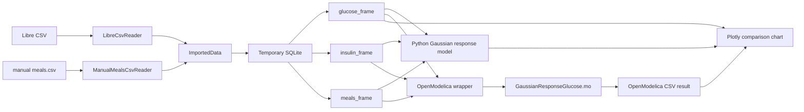

# Modelica workflow visualization

Tento Mermaid diagram ukazuje tok dat a modelu ve webove aplikaci: od vstupnich
CSV souboru pres readery a docasnou SQLite databazi az po Python model,
OpenModelica simulaci a spolecny Plotly graf.

